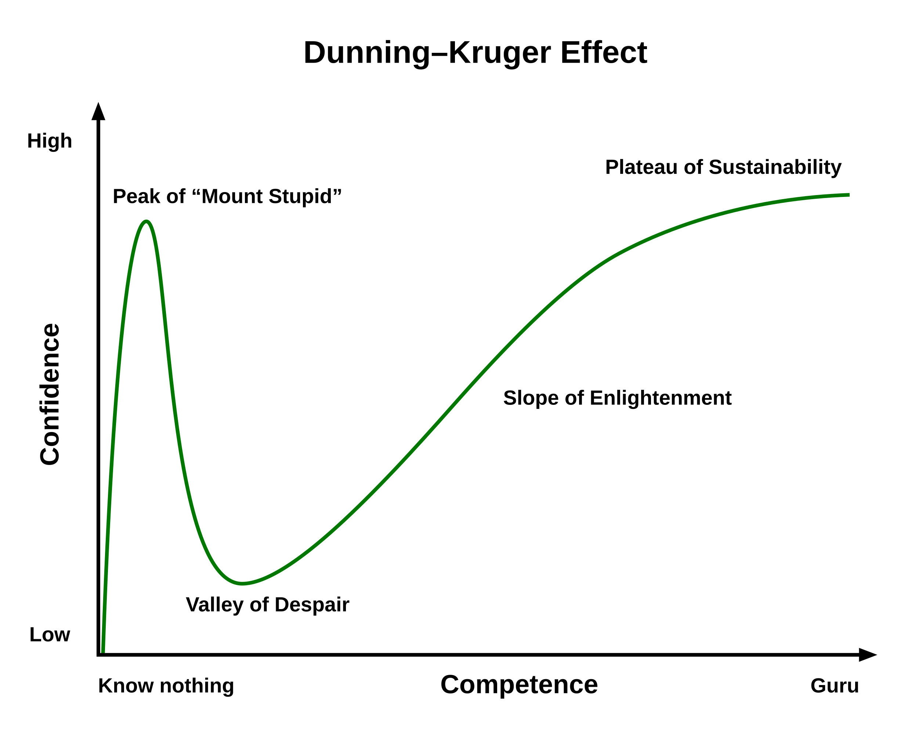

# Images With Titles

The examples below pull from `docs/images/` to validate image handling with titles.

Use these alongside *inline emphasis* in captions or surrounding text to ensure both render together.
